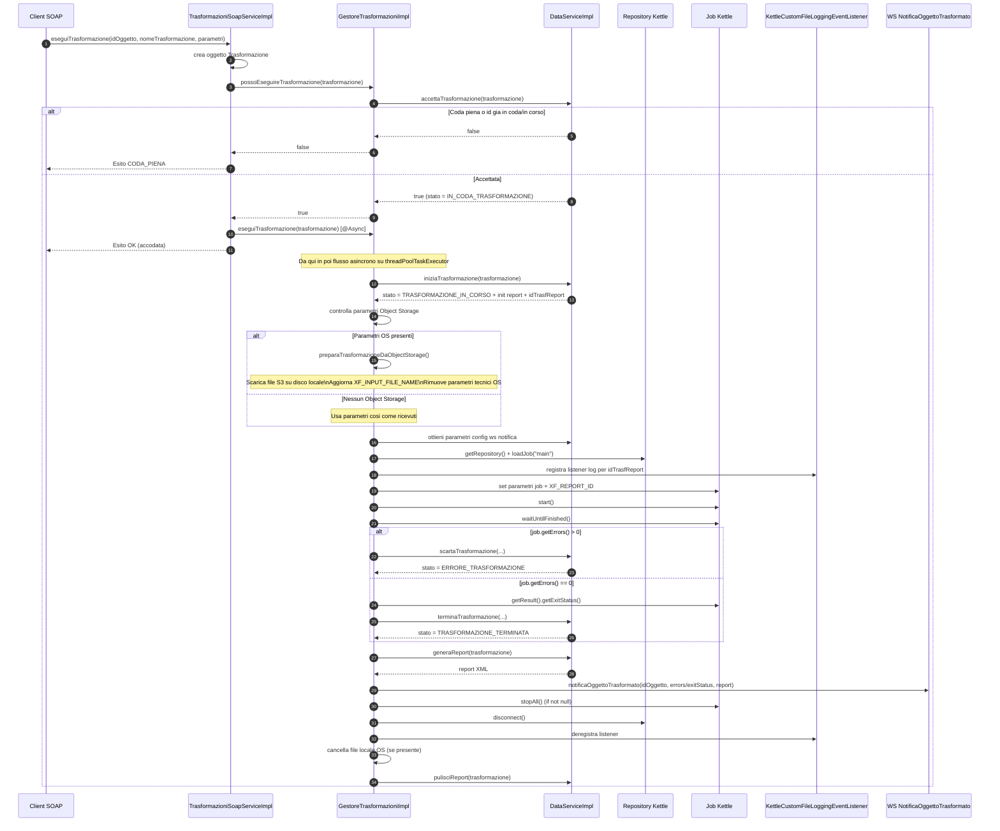
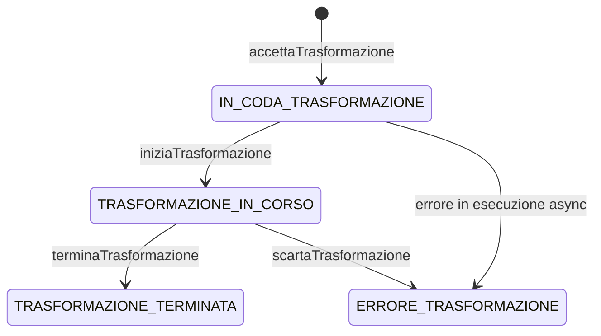

# Flusso `eseguiTrasformazione`

Questo documento descrive il workflow completo della chiamata SOAP `eseguiTrasformazione`, distinguendo la parte sincrona (risposta al chiamante) dalla parte asincrona (esecuzione reale del job Kettle).

## Vista sequenziale end-to-end

## Dettaglio stati monitoraggio

## Note operative

- La risposta SOAP `OK` indica accodamento, non completamento della trasformazione.
- L'esecuzione reale avviene in async (`@Async("threadPoolTaskExecutor")`).
- In `finally`, il servizio prova sempre a rilasciare risorse e pulire report/log temporanei.
- Se il download da Object Storage e attivo, il file locale viene eliminato a fine flusso.

## Riferimenti codice

- `parer-kettle-soap/src/main/java/it/eng/parer/kettle/soap/TrasformazioniSoapServiceImpl.java`
- `parer-kettle-server/src/main/java/it/eng/parer/kettle/server/persistence/service/GestoreTrasformazioniImpl.java`
- `parer-kettle-server/src/main/java/it/eng/parer/kettle/server/persistence/service/DataServiceImpl.java`
- `parer-kettle-server/src/main/java/it/eng/parer/kettle/server/config/KettleBeanConfig.java`
- `parer-kettle-server/src/main/java/it/eng/parer/kettle/server/config/KettleCustomFileLoggingEventListener.java`

